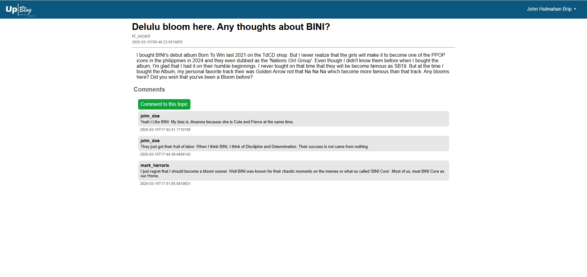
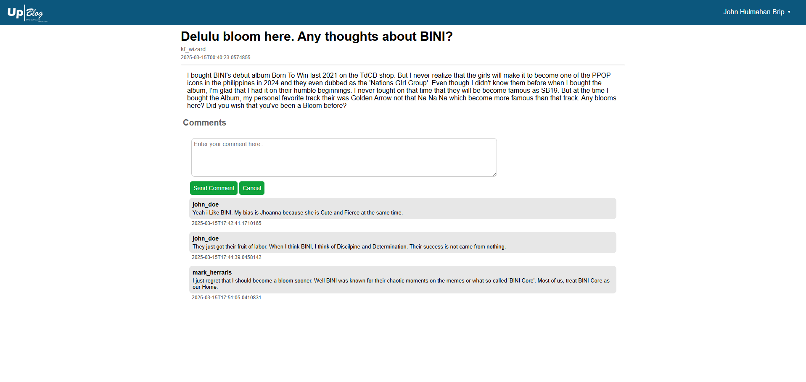

# Up Blog

Blog application demo to enhance my skills for Angular and .NET.

## Todos 
1. Create Error Page
2. Implement Reaction
3. Convert State Management from RxJS Behavorial Subject to NgRx
4. Settle CSS styles on each component as they have same css.
5. Implement User Avatar and Article Banner (As of now all articles use same banner (BINI))

## Some screenshots for the app
 

 

